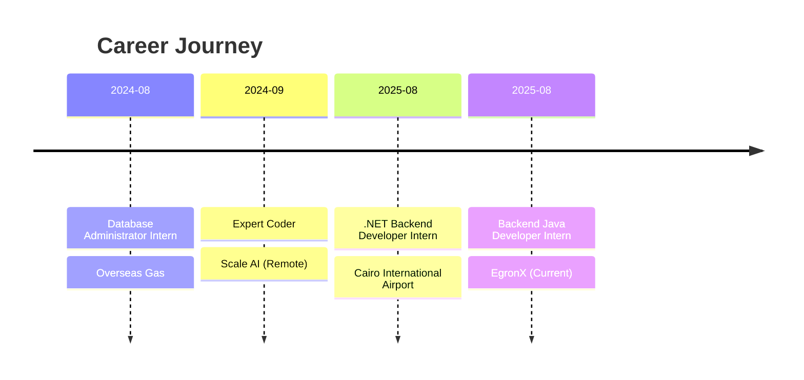

<div align="center">
  
</div>

<h3 align="center">🎓 Information Systems Student @ Cairo University | GPA: 3.44/4.0 (Top 4%)</h3>
<h4 align="center">🏆 Ranked 49th out of 1200+ Students</h4>

<p align="center">
  
  
</p>

---

### 👨‍💻 About Me

```javascript
const mohamedTaha = {
    location: "Cairo, Egypt 🇪🇬",
    role: "Backend Developer",
    education: {
        university: "Cairo University - FCAI",
        major: "Information Systems",
        gpa: "3.44/4.0",
        rank: "49/1200+ (Top 4%)"
    },
    experience: [
        "Backend Java Developer @ EgronX",
        ".NET Backend Developer @ Cairo International Airport",
        "Expert Coder @ Scale AI",
        "Database Administrator @ Overseas Gas"
    ],
    currentFocus: [
        "Building scalable backend systems",
        "Optimizing database performance",
        "AI-assisted programming",
        "RESTful API design"
    ],
    techStack: {
        backend: ["Java Spring Boot", "Django", ".NET", "Entity Framework"],
        languages: ["Java", "C#", "Python", "C/C++", "SQL", "JavaScript"],
        databases: ["SQL Server", "MySQL", "PostgreSQL"],
        tools: ["Git", "Docker", "Jira", "Postman", "VS Code"]
    },
    expertise: ["REST APIs", "OOP", "Design Patterns", "SOLID Principles", "SDLC"],
    languages: ["Arabic (Native)", "English (Fluent - C1)"],
    achievements: "Contributed to mission-critical systems at Cairo Airport",
    contact: "mhmdth276@gmail.com"
};
```

---

### 🤝 Connect with Me

<p align="center">
<a href="https://www.linkedin.com/in/mtaha20/" target="_blank">
  
</a>
<a href="mailto:mhmdth276@gmail.com" target="_blank">
  
</a>
<a href="https://leetcode.com/u/Mohamed_Taha19/" target="_blank">
  
</a>
<a href="https://discord.gg/mohammed_taha" target="_blank">
  
</a>
</p>

---

### 💼 Professional Experience



<table>
<tr>
<td width="50%">

**🚀 Backend Development**
- RESTful API design & optimization
- Microservices architecture
- Database performance tuning
- Mission-critical system support

</td>
<td width="50%">

**🤖 AI & Automation**
- LLM code review & validation
- Prompt engineering strategies
- AI-assisted programming
- Automated reporting systems

</td>
</tr>
</table>

---

### 🛠️ Tech Stack & Tools

<details open>
<summary><b>⚙️ Backend & Frameworks</b></summary>
<br>
<p align="center">
  
  
  
  
  
</p>
</details>

<details open>
<summary><b>💾 Databases & Data Management</b></summary>
<br>
<p align="center">
  
  
  
  
</p>
</details>

<details open>
<summary><b>💻 Programming Languages</b></summary>
<br>
<p align="center">
  
  
  
  
</p>
</details>

<details open>
<summary><b>🔧 Tools & Technologies</b></summary>
<br>
<p align="center">
  
  
  
  
  
  
</p>
</details>

---

### 🚀 Featured Projects

<table>
<tr>
<td width="50%">
<h3 align="center">🎮 GamerMajlis</h3>
<div align="center">


<p><strong>Next-Gen Gaming Platform</strong></p>
<p align="left">
✨ Full-stack platform connecting gamers<br/>
🏆 Tournament system & community chat<br/>
🛒 Hardware marketplace integration<br/>
🤖 AI-powered chatbot assistance<br/>
⚡ RESTful APIs with Spring Boot
</p>
</div>
</td>
<td width="50%">
<h3 align="center">🍳 Wasfit Mama</h3>
<div align="center">


<p><strong>Recipe Discovery Platform</strong></p>
<p align="left">
🔐 Role-based access control<br/>
🎯 Personalized recommendations<br/>
🔌 API integration & backend logic<br/>
📱 Responsive UI design<br/>
🗃️ Django-powered backend
</p>
</div>
</td>
</tr>
<tr>
<td width="50%">
<h3 align="center">📚 Learning Management System</h3>
<div align="center">


<p><strong>Course Management Backend</strong></p>
<p align="left">
📖 Assignment & notification system<br/>
🔒 Role-based security (JWT)<br/>
🏗️ 3-tier architecture design<br/>
⚡ Scalable REST APIs<br/>
🗄️ MySQL database integration
</p>
</div>
</td>
<td width="50%">
<h3 align="center">💼 Customer Service System</h3>
<div align="center">


<p><strong>Desktop Data Management</strong></p>
<p align="left">
🔍 CRN-based customer search<br/>
✏️ Real-time data editing<br/>
📊 Excel export functionality<br/>
⚡ Improved operational efficiency<br/>
🗂️ Streamlined data management
</p>
</div>
</td>
</tr>
</table>

---

### 📊 GitHub Analytics

<div align="center">
  
  
</div>

<div align="center">
  
  
</div>

---

### 🏆 Achievements & Certifications

<div align="center">
  
</div>

---

### 💡 Problem Solving & Competitive Programming

<div align="center">
  
</div>

---

### 📈 Contribution Activity

<div align="center">
  <picture>
    <source media="(prefers-color-scheme: dark)" srcset="https://raw.githubusercontent.com/Mohamed-Taha20/Mohamed-Taha20/output/github-contribution-grid-snake-dark.svg">
    <source media="(prefers-color-scheme: light)" srcset="https://raw.githubusercontent.com/Mohamed-Taha20/Mohamed-Taha20/output/github-contribution-grid-snake.svg">
    
  </picture>
</div>

---

### 💭 Random Dev Quote

<div align="center">
  
</div>

---

<div align="center">
  <h3>🎯 "Building scalable systems, one commit at a time"</h3>
  <p>
    <i>💼 Open to Backend Development opportunities | 🤝 Available for collaborations</i><br/>
    <i>📧 Reach me at: <a href="mailto:mhmdth276@gmail.com">mhmdth276@gmail.com</a></i>
  </p>
  
  
</div>
